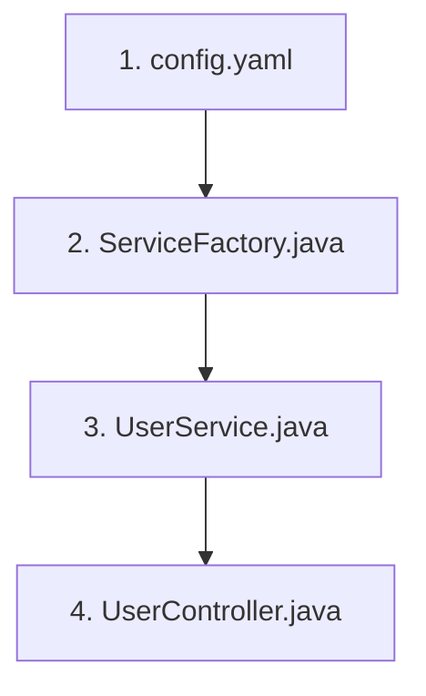

# Plan Workflow

## Invocation Rules (from plan command)

When invoked (e.g. via `/plan` or "plan {issue_key}"):

- **Required**: issue key (e.g. OCTOPUS-10820)
- **If no issue key**: STOP and ask "Which issue key do you want to plan? (e.g. OCTOPUS-10820)"
- **Step 0 (routing)**: Call `jira_get_issue` first to resolve issue type
- **Prerequisite**: `spec-{issue_key}.md` must exist. If not, abort: "Run specify workflow first."
- **Critical**: Don't assume anything — follow the plan exactly
- **Critical**: Stop at transitions (Step 3) and ask the user to select the Jira transition for the Story, Task, Bug, or Epic before proceeding

---

Creates the implementation plan document from a specification for a single Jira issue (Epic, Story, Task, or Bug). Execute steps sequentially; do not skip steps.

## ⚠️ CRITICAL — Never Skip Steps

1. Do not jump any implementation step, start for the begining
2. If you have any doubt abouit execution steps, stop process ask you doubt and continue

## Prerequisites

- **Get repository**: use `{issue_key}` to get repository and identify `<repository>`
- **Input**: `{issue_key}` (e.g., OCTOPUS-10820) and `<repository>/README.md`
- **Input**: `{issue_key}` (e.g., OCTOPUS-10820)
- **Required**:
  - `<repository>/analysis/spec-{issue_key}.md` must exist. If not, abort with: "Issue has not been specified yet. Run specify workflow first."
  - check if `<repository>/analysis/plan-{issue_key}.md` exist delete it and remove
- **MCP servers**: atlassian, github

---

# Testing configuration

**Critical**: we have sonarqube and we need to be compliance
**Mandatory**: coverage minimun 90% for new development and modification

## Step 1

- Check the total coverage for modified or new files SHOULD be more that 90%.
- If coverage is less than 90% add necessary tests

---

# Execute on plan creation

## Step 1: Check spec `<repository>/analysis/spec-{issue_key}.md`exist.

- Check if `<repository>/analysis/spec-{issue_key}.md` exists
- **On failure**: abort with "Issue has not been specified yet. Run specify workflow first."

## Step 2: Remove Plan Label

- Use mcp-atlassian `jira_update_issue` to remove label `bot-cx-ai-plan` from the Jira issue (if present)
- Check if `<repository>/analysis/plan-{issue_key}.md` exists and delete
- No error if label is absent

## Step 3: Execute Epic, Story, Task, or Bug transition (BLOCKING STEP)

> **MANDATORY checkpoint**: this is a breakpoint ask and wait for user input

- **Ask User**: Present the available status options to the user.
- **WAIT**: Stop execution here. Do not generate the file yet.
- **Action**: Only after the user chooses and the transition is executed via `jira_transition_issue`

| Step | Action                               | Command / Description                                                                    |
| ---- | ------------------------------------ | ---------------------------------------------------------------------------------------- |
| 1    | transition Epic, Story, Task, or Bug | transition Epic, Story, Task, or Bug. Transition `{issue_key}` use jira-transition skill |

---

# Execution Plan (MANDATORY — include in plan output)

- > **MANDATORY checkpoint**: STOP on mandatory checkpoints and wait for user input.
- > **BLOCKING steps (1, 3, 5)**: Always stop and ask the user. Never infer "skip" from prior messages (e.g. "continua", "continue", "proceed").
- > **When resuming** (user says "continue", "proceed", "resume"): Before continuing, remind: "For any new folders in this plan, remember to add the Developer Recommendation section at the end (RULE.md — developer-only, not in implementation)."

- **Agent instructions**: When implementing this plan, you MUST execute the Execution Plan sequentially from Step 1. Do NOT skip steps.
- **Implement handoff (implement-workflow)**: When someone runs `/implement` or says “implement {issue_key}”, that only starts the implement skill—it **does not** waive **Execution Plan step 1** if step 1 is BLOCKING (Jira transition). The implementer must **not** run git checkout, pull, branch creation, or code changes until step 1 is resolved with user-chosen `jira_transition_issue` (or an explicit allowed “no transition” if the process permits). See **implement-workflow** “Pre-flight gate” and “Debunk a common mistake.”
- **The plan document MUST include an "Execution Plan" section** with this table. Place it near the top, after Overview/Prerequisites. This is the sequential workflow the agent must follow; do not omit it.
- **Execute in order**: 1 → 2 → 3 → 4 -> 5 -> 6. On step failure: log error, continue, report failures at end.

## Execution Plan step 1: Execute Epic, Story, Task, or Bug transition (BLOCKING STEP)

> **MANDATORY checkpoint**: this is a breakpoint ask and wait for user input

- **Ask User**: Present the available status options to the user.
- **WAIT**: Stop execution here. Do not generate the file yet.
- **Action**: Only after the user chooses and the transition is executed via `jira_transition_issue`

| Step | Action                               | Command / Description                                                                    |
| ---- | ------------------------------------ | ---------------------------------------------------------------------------------------- |
| 1    | transition Epic, Story, Task, or Bug | transition Epic, Story, Task, or Bug. Transition `{issue_key}` use jira-transition skill |

## Execution Plan step 2: Checkout new branch (MANDATORY — include in plan output)

| Step | Action                 | Command / Description                       |
| ---- | ---------------------- | ------------------------------------------- |
| 1    | git_branch_list        | `git branch -a`                             |
| 2    | git_checkout_principal | `git checkout main\|master\|trunk`          |
| 3    | git_pull               | `git pull origin <principal>`               |
| 4    | branch_init            | `git checkout -b {branch_type}/{issue_key}` |

## Execution Plan step 3: Before star development command question (MANDATORY — include in plan output)

> **MANDATORY checkpoint**: this is a breakpoint ask and wait for user input

- before development command: Ask to the user if he want to execute any command before start development
- **Critical**: Do not take into account previous user responses (e.g. "continue", "skip", "proceed").
- **Critical**: NEVER skip this step. Always stop and ask, regardless of prior messages.
- **Ask User**: Stop and ask user if whan to execute command.
- **WAIT**: Stop execution here. Do not jump to next step .

## Execution Plan step 4: Implementation (MANDATORY — include in plan output)

- **The plan document MUST include an "Execution Plan" section** with this table. Place it near the top, after Overview/Prerequisites. This is the sequential workflow the agent must follow; do not omit it.
- **Include this preamble in the plan output** (so the implementing agent sees it):

| Step | Action         | Command / Description                       |
| ---- | -------------- | ------------------------------------------- |
| 1    | implementation | Execute Step_by_step_task_plan (Tasks 1..N) |

**Rules**: EXECUTE SEQUENTIALLY. DO NOT JUMP STEPS. Steps marked MANDATORY must never be skipped.
**Implementation sub-steps**:

- 1_A: Check if Jira provides similar implementations for the issue
- 1_B: Study similar implementation patterns and file structure
- 1_C: **Follow File Dependency Graph** for order of file creation/modification
- 1_D: **Follow File-Level Detail** for exact contents of each file (contracts, config, logic)
- 1_E: Implement the issue task following patterns found
- 1_F: Do not repeat the same code across different files
- 1_G: **RULE.md**: Do NOT create RULE.md during implementation. RULE.md is a developer-only recommendation (see "Recommendation for Developer" at the end of the plan). The implementing agent must not add RULE.md to any folder.

## Execution Plan step 5: after development done command question (MANDATORY — include in plan output)

> **MANDATORY checkpoint**: this is a breakpoint ask and wait for user input

- after development command: Ask to the user if he want to execute any command after start development
- **Critical**: Do not take into account previous user responses (e.g. "continue", "skip", "proceed").
- **Critical**: NEVER skip this step. Always stop and ask, regardless of prior messages.
- **Ask User**: Stop and ask user if whan to execute command.
- **WAIT**: Stop execution here. Do not jump to next step .

## Execution Plan step 6: Testing (MANDATORY — include in plan output)

- **The plan document MUST include an "Execution Plan" section** with this table. Place it near the top, after Overview/Prerequisites. This is the sequential workflow the agent must follow; do not omit it.
- **Include this preamble in the plan output** (so the implementing agent sees it):

| Step | Action | Command / Description                          |
| ---- | ------ | ---------------------------------------------- |
| 1    | tests  | Write/run, following the Testing configuration |

---

# Execute on finish plan creation

## Step 1: Execute Epic, Story, Task, or Bug transition (BLOCKING STEP)

> **MANDATORY checkpoint**: this is a breakpoint ask and wait for user input

- **Ask User**: Present the available status options to the user.
- **WAIT**: Stop execution here. Do not generate the file yet.
- **Action**: Only after the user chooses and the transition is executed via `jira_transition_issue`

| Step | Action                               | Command / Description                                                                    |
| ---- | ------------------------------------ | ---------------------------------------------------------------------------------------- |
| 1    | transition Epic, Story, Task, or Bug | transition Epic, Story, Task, or Bug. Transition `{issue_key}` use jira-transition skill |

## Step 2: Add label and save plan

- Add label `bot-cx-ai-plan` to `{issue_key}`
- **STOP**: Save plan.

## Step 3: Summary to user (MANDATORY)

When presenting the final summary to the user after plan creation, the agent **MUST** include:

1. Plan file path and Jira label/status
2. Brief overview of what the plan covers
3. **Recommendation for Developer** — Mention that the plan includes at the end a "Recommendation for Developer" section (developer-only). RULE.md is optional and the implementing agent does NOT create it; it is a recommendation for the developer to add manually if they wish. List paths and new files.

**Rule**: Omitting the Recommendation for Developer from the summary is not allowed. The user must be informed that RULE.md is developer-only and not part of the implementation.

---

### Other Sections

- **Target_Repository**: `<repository>`
- **Technical_Context**: Language_Version, Primary_Dependencies, Storage, Testing, Project_Type
- **Project_Structure**: Document real directories
- **File Dependency Graph**: Order of files, relationships, diagram (Mermaid or table) — defines the "thread" for code review
- **File-Level Detail**: Per-file contents (contracts, config keys, logic) — as detailed as possible
- **Step_by_step_task_plan**: Ordered implementation steps (the actual coding tasks)

---

# File Dependency Graph (MANDATORY — include in plan output)

**Purpose**: When reviewing code with many modified/created files, this graph defines the "thread" to follow when verifying changes. It shows which files to touch, in what order, and how they relate.

**Required**: The plan MUST include a **File Dependency Graph** section with:

1. **Order of modification**: List files in the sequence they should be created/modified (e.g., 1 → 2 → 3).
2. **Relationships**: For each file, indicate dependencies (imports, contracts used, config consumed).
3. **Diagram format**: Use Mermaid flowchart or ASCII diagram. Example:



**Vertical flow (explicando conexiones)** — para cada flecha, indica qué significa la dependencia:

```
1. config.yaml
   │
   │  → ServiceFactory lee esta config (timeout, retry, etc.)
   ▼
2. ServiceFactory.java
   │
   │  → UserService obtiene instancias vía esta factory
   ▼
3. UserService.java
   │
   │  → UserController llama a UserService para la lógica de negocio
   ▼
4. UserController.java

   Expone endpoints REST; no tiene dependientes en este flujo
```

**Rule**: Each arrow must have a brief explanation of the relationship (imports, reads, calls, implements, etc.).

Or a table:

| Order | File                      | Depends on       | Relationship        |
| ----- | ------------------------- | ---------------- | ------------------- |
| 1     | config/app.yml            | —                | Base config         |
| 2     | contracts/UserApi.yaml    | —                | API contract        |
| 3     | services/UserService.java | config, contract | Implements contract |

**Rules**: Every file in Step_by_step_task_plan MUST appear in the graph. The order must match the implementation sequence.

---

# File-Level Detail (MANDATORY — include in plan output)

**Purpose**: For each file to be modified or created, specify exactly what will go inside so the implementer and reviewer know what to expect.

**Required**: The plan MUST include a **File-Level Detail** section. For each file, document:

| File                 | Type (new/modify) | Contents (as detailed as possible)                                                                                                                                |
| -------------------- | ----------------- | ----------------------------------------------------------------------------------------------------------------------------------------------------------------- |
| `path/to/file.ext`   | new               | **Contracts**: `UserApi.yaml` (endpoints X, Y). **Config**: `timeout: 30`, `retry: 3`. **Logic**: Class X with methods A, B. **Dependencies**: imports from P, Q. |
| `path/to/config.yml` | modify            | Add section `[feature]` with keys `enabled`, `max_items`. Values: boolean, int.                                                                                   |

**Detail level by file type**:

- **API/Contract files**: Which endpoints, request/response schemas, status codes.
- **Config files**: Exact keys, types, default values, environment-specific overrides.
- **Service/Logic files**: Classes, methods, contracts implemented, external calls.
- **Tests**: What scenarios, mocks used, coverage target.
- **DTOs/Models**: Fields, validations, mapping to/from contracts.

**Rules**: Be as specific as possible. Avoid vague descriptions like "add logic" — specify what logic, which contract, which config keys. **Do NOT include RULE.md in File-Level Detail** — RULE.md is a developer-only recommendation at the end of the plan; the implementing agent must not create it.

---

# Scoped Rules — New folders/files list (MANDATORY to include in plan output)

**Purpose**: List explicitly every new folder and new file created by the plan. This helps the developer and reviewer understand the scope of changes.

**Required**: When the plan creates **new files or folders**, the plan MUST:

1. **List new folders and new files explicitly**: Add a table listing every new folder and every new file created by the plan (e.g. `src/providers/BaggageInfoProvider/` as new folder; `src/clientState/queries/baggageInfo.js`, `src/providers/BaggageInfoProvider/BaggageInfoProvider.js` as new files). Focus on new file creation — be precise, not generic.
2. **Do NOT include RULE.md in File-Level Detail or Step_by_step_task_plan**: RULE.md is NOT part of the implementation. The implementing agent must NOT create RULE.md. RULE.md is only mentioned in the "Recommendation for Developer" section at the end of the plan (developer-only, optional).

**Example** (Scoped Rules section structure):

```
This plan creates **one new folder** and **three new files**:

| New folder / file | Type |
| ----------------- | ---- |
| `src/providers/BaggageInfoProvider/` | new folder |
| `src/clientState/queries/baggageInfo.js` | new file (existing folder) |
| `src/providers/BaggageInfoProvider/BaggageInfoProvider.js` | new file |
| `src/providers/BaggageInfoProvider/index.js` | new file |
```

**Rule**: Do NOT add RULE.md to File-Level Detail or to the implementation tasks. RULE.md is exclusively a developer recommendation at the end of the plan.

---

# Developer Recommendation (RULE.md) — End of Plan (MANDATORY)

**Purpose**: The plan MUST include at the **end** a section addressed **exclusively to the developer (human user)**. This is the ONLY place where RULE.md is mentioned. The implementing agent must NOT create RULE.md — it is an optional recommendation for the developer to add manually if they wish.

**Required**: Place this section at the **very end** of the plan document, after Notes or Verification Checklist. Use a clear heading (e.g. "Recommendation for Developer" or "Recomendación para el desarrollador").

**Content to include** (adapt language to project/audience):

1. **Scope**: This section applies ONLY to the developer (human). The implementing agent does NOT create RULE.md.
2. **Direct call to the developer**: Recommend adding `RULE.md` in the specific new folder path(s) — e.g. "Add `RULE.md` in `src/providers/BaggageInfoProvider/`". Do NOT use generic "in each new folder"; list the exact path(s) from the plan.
3. **List new files created**: Explicitly list the new files created by the plan (e.g. `baggageInfo.js`, `BaggageInfoProvider.js`, `index.js`). Focus on new file creation.
4. **Why it matters** (optional for developer):
   - **Locality of Reference**: Rules live next to the code they affect; the AI agent loads only relevant context, reducing hallucination and token waste.
   - **Onboarding**: New contributors (human or AI) understand patterns and conventions for that folder quickly.
5. **What to put in RULE.md**: Specify which files to load (by path), patterns, conventions, and dependencies for that folder.
6. **Example**: include short example

**Rule**: Every plan that creates new folders MUST end with this Developer Recommendation section. RULE.md is mentioned ONLY here — never in File-Level Detail, Step_by_step_task_plan, or implementation. Be precise — use actual paths from the plan, not generic wording.

---

# Resume Plan — Reminder (when user says "continue", "proceed", "resume")

When the user resumes plan generation (after any BLOCKING step), **remind** before continuing:

> **Developer Recommendation reminder**: For new folders in this plan, include at the end a "Recommendation for Developer" section (developer-only). Do NOT add RULE.md to File-Level Detail or implementation tasks. RULE.md is mentioned ONLY in that final section.

---

# Review Plan

- **Review** the plan file at `<repository>/analysis/plan-{issue_key}.md`
- **Action**: run agent again to review in deep way the plan and modified it

---

## Output

- **File**: `<repository>/analysis/plan-{issue_key}.md`
- **Required sections**: Overview, Prerequisites, **Execution Plan** (table + preamble above), **File Dependency Graph**, **File-Level Detail**, **Scoped Rules** (new folders/files list — no RULE.md in implementation), Implementation Tasks (Step_by_step_task_plan), Verification Checklist, **Developer Recommendation (RULE.md) — at end of plan only, developer-only**. The Execution Plan table, File Dependency Graph, File-Level Detail, Scoped Rules (folders/files list), Developer Recommendation at end, and agent instructions preamble are mandatory. RULE.md must NOT appear in File-Level Detail or implementation tasks.
